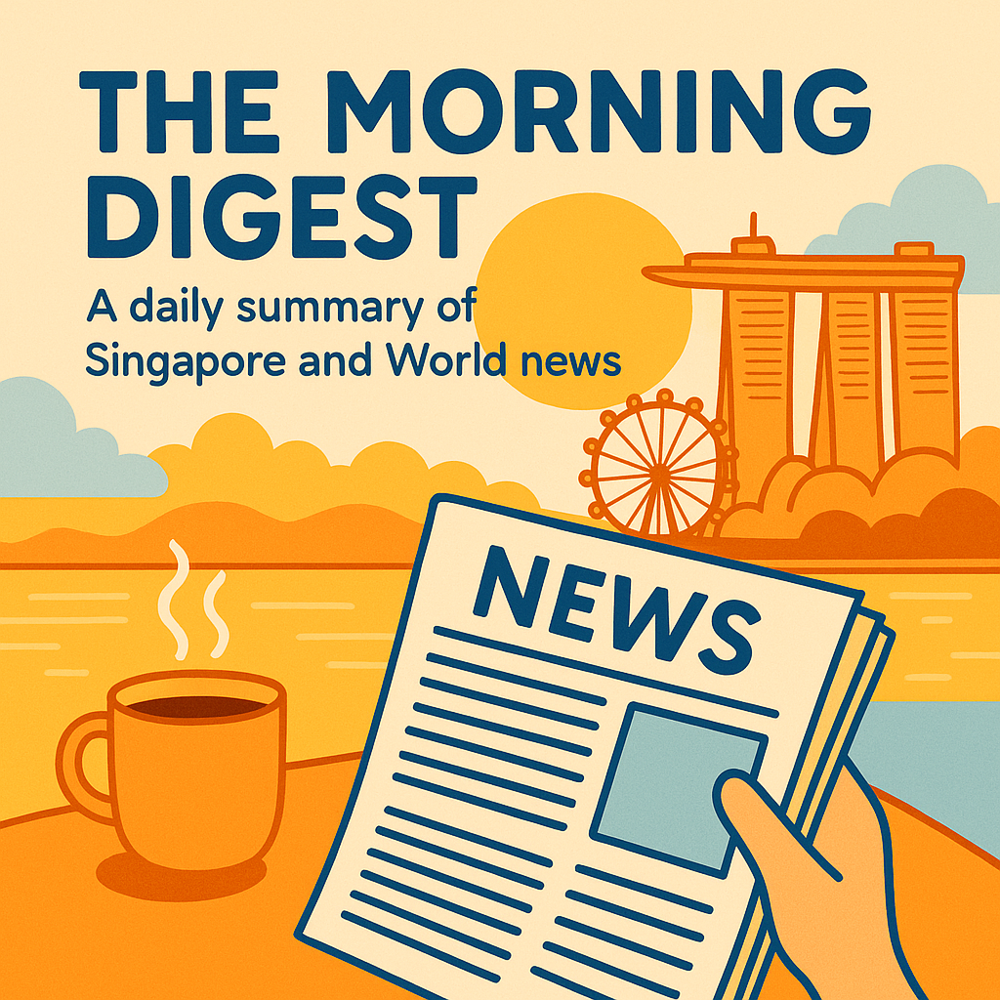

# MorningDigest

MorningDigest is a five-minute, AI-assisted morning briefing tailored for busy Singaporeans who want to stay sharp on local and international news.

## Why MorningDigest?
In today's fast-paced society, busy professionals are gravitating toward podcasts, short reels, and snackable digests instead of traditional papers. Yet, being informed about the world remains non-negotiable for every global citizen. While tech and finance circles already enjoy summariser tools that keep commuters up to speed, the average Singaporean still lacks a trusted companion to stay current without sacrificing precious time. MorningDigest bridges that gap by delivering a concise, Singapore-first news briefing that readers can finish within five minutes and still keep pace with the Jonesses.

## News Sources
MorningDigest currently aggregates headlines from two primary sources:

- [Channel News Asia](https://www.channelnewsasia.com)
- [The Straits Times](https://www.straitstimes.com)

Under the hood, the system treats each news provider as a pluggable RSS source. As long as a publisher exposes an RSS (or Atom) feed, it can be wired into the same ingestion, filtering, and summarisation pipeline with minimal configuration changes—not a full rewrite.

From a developer’s perspective, this means:

- Adding a new source is mostly a matter of:
    - Registering the RSS endpoint,
    - Defining a lightweight mapping to MorningDigest’s internal article schema, and
    - Optionally tuning source-specific rules (e.g., section filters or language tags).
- The rest of the stack—parsing, embedding, clustering, and ranking—works uniformly across all providers.

In the future, subscribed users will be able to:

- Select their preferred news outlets (local and international),
- Mix and match languages, and
- Save these as personalised “source profiles” without any extra engineering effort.

# Diversity-Aware Multi-Source Headline Ranking Algorithm: Extracting Top Headlines across Diverse News Outlets

To surface the most useful mix of headlines each morning, MorningDigest runs every candidate article through a compact ranking pipeline:

1. **Embed each headline**  
    Each headline is converted into a high‑dimensional vector using a sentence‑embedding model. Headlines that talk about similar topics end up close together in this vector space.

2. **Cluster related headlines with HDBSCAN**  
    Using [HDBSCAN](https://hdbscan.readthedocs.io/), we automatically group similar headlines into clusters (e.g., “local politics”, “markets”, “tech layoffs”).  
    - Clustering is density‑based, so it can discover clusters of different sizes.  
    - Outliers (very niche or noisy stories) are treated as their own small clusters or discarded, depending on configuration.

3. **Pick a representative headline per cluster**  
    For each cluster, we identify a *medoid*—the headline whose embedding is most central to the cluster. This serves as the “spokesperson” for that topic and becomes a candidate for the final digest.

4. **Rank with Maximal Marginal Relevance (MMR)**  
    From the pool of medoids, we apply **Maximal Marginal Relevance** to pick a subset that is:
    - **Highly relevant** to the day’s overall news landscape, and  
    - **Non‑redundant**, by penalising items that are too similar to headlines already selected.

This gives MorningDigest an adjustable, diversity‑aware shortlist of top stories that:

- Covers the day’s main themes across sources,
- Avoids repeating near‑duplicate headlines, and
- Can be tuned to show *N* items (e.g., 8–12) depending on product needs.

In practice, the result is a compact, information‑dense set of headlines that captures the breadth of each morning’s news without overwhelming the reader.

## Partnership
Let’s collaborate to bring smarter mornings to more readers. Reach me on [LinkedIn](https://www.linkedin.com/in/chanchoonyong).
